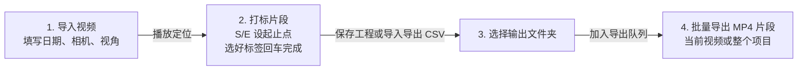
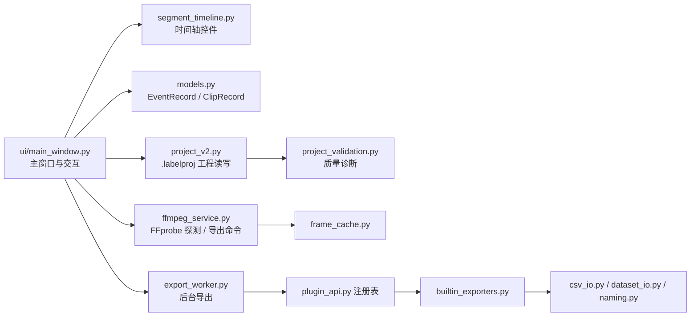

# 视频片段标注工具（Video Segment Labeler）

  

面向**标注员和小团队**的 Windows 桌面视频标注工具：给长视频的片段打**行为标签**，用 `.labelproj` 工程管理标注结果，并通过 **FFmpeg** 批量导出 MP4 片段。

- 基于 **PySide6** 构建，界面为简体中文
- 克隆仓库后按下方「快速开始」装好依赖，运行 `python app.py` 即可启动

## 功能特性

| 能力 | 说明 |
| --- | --- |
| 片段标注 | 导入视频后播放、逐帧定位（`S`/`E` 设起止点，`回车` 完成片段）；为片段标注行为标签（可多选）、正负性、光照、视角，以及年龄段、人员熟悉度、人数、备注等属性（`video_labeler/models.py`） |
| 快速标注 | 连标模式（`Ctrl+L`）自动沿用上一片段的全部标签并跳到新起点；数字键 `1-9` 直选行为标签；常用标签可钉选固定位置；`R` 沿用上一片段标签 |
| 审核工作流 | 审核模式下数字键 `1/2/3/4` 置审核状态（通过 / 需修正 / 剔除 / 待审核），记录审核人、审核时间与审核历史；支持多选后批量修改片段 |
| 审计字段 | 每条片段自动记录标注人（默认取 Windows 用户名）与创建/修改时间 |
| 工程管理 | 工程保存为 v2 `.labelproj`，视频与输出目录优先使用相对路径，并缓存时长、分辨率、帧率、编码器等元数据；v1 工程打开时在内存中迁移，保存后写入 v2 |
| 备份与恢复 | 自动备份到工程同目录 `.backups/`（默认开启），手动版本快照保存到 `.versions/`，均可随时恢复；可选开启每 30 秒自动保存主工程文件 |
| 会话恢复 | 启动时检测上次的工程、视频和播放位置，可一键恢复 |
| 质量检查 | 「检查工程质量」核对视频路径、片段时间范围、输出文件名与片段重叠情况；「定位缺失视频」按文件名唯一匹配找回跨机器迁移后的视频 |
| 批量导出 | 导出当前视频片段，或将全工程片段加入同一导出队列（sidecar 文件为 `<工程>.labelproj.export-queue.json`）；导出先写入带 UUID 的 `.part.mp4` 临时文件，经 FFprobe 验证后才发布为最终文件 |
| 数据交换 | 导出/导入完整标注 CSV（含标注人与时间列）；导入预标注 JSON（带可勾选预览表，便于人工复核）；导出 JSONL / YOLO 标签数据集；查看并导出工程统计 JSON |
| 插件导出 | 内置 JSONL 和 YOLO 导出器，通过 `plugin_api` 注册；支持加载导出插件、扫描插件目录、查看可用导出器 |
| 效率与体验 | 时间轴上拖拽片段条两端微调起止时间；片段表格支持按行为、正负性、导出状态、审核状态和关键词筛选，表头可排序；撤销/重做；快捷键可配置；深色模式；操作日志面板 |

以上能力均可在 `video_labeler/` 包中找到对应实现。

## 快速开始

### 环境要求

- Python 3.10 或更高版本
- Windows 上可运行的 **FFmpeg** 和 **FFprobe**（外部依赖，不随程序分发，安装方法见下文）

### 安装与启动

在项目根目录依次执行：

1. 创建并激活虚拟环境：

   ```powershell
   py -m venv .venv
   .\.venv\Scripts\Activate.ps1
   ```

2. 安装依赖：

   ```powershell
   python -m pip install -r requirements.txt
   ```

3. 启动程序：

   ```powershell
   python app.py
   ```

### 安装 FFmpeg / FFprobe

下载适用于 Windows 的 FFmpeg 构建版本，将其 `bin` 目录（须同时包含 `ffmpeg.exe` 和 `ffprobe.exe`）加入系统 `PATH`，重新打开终端后验证：

```powershell
ffmpeg -version
ffprobe -version
```

也可以在程序的 FFmpeg 设置中填写 `ffmpeg.exe` 的绝对路径，程序会在同一目录查找 `ffprobe.exe`。

## 使用说明

基本标注流程：



1. **导入视频**：导入一个或多个视频，填写日期、相机和视角。
2. **打标片段**：播放视频，设置片段起止时间，选择行为、正负样本与光照标签，然后完成片段。
3. **选择输出**：选择输出文件夹。可保存 `.labelproj` 工程或导出/导入 CSV。
4. **导出片段**：「批量导出」导出当前视频的片段；「导出整个项目」将工程内所有视频的片段加入同一导出队列。

> 更详细的界面布局、连标打法、审核流程和故障排查见 [docs/用户操作手册.md](docs/用户操作手册.md)。

### 快捷键

默认快捷键如下（「设置」菜单 →「配置快捷键」可修改，保存在 `%APPDATA%\VideoSegmentLabeler\preferences.json`）：

| 按键 | 作用 |
| --- | --- |
| Space | 播放 / 暂停 |
| A / D | 上一帧 / 下一帧 |
| PgUp / PgDown | 后退 / 前进 1 分钟 |
| Shift+PgUp / Shift+PgDown | 后退 / 前进 10 分钟 |
| S / E | 设为起始点 / 结束点 |
| 回车 | 完成片段（添加或更新） |
| R | 沿用上一片段的标签 |
| Del | 删除选中片段 |
| Ctrl+Z / Ctrl+Y | 撤销 / 重做 |
| Ctrl+S | 保存工程 |
| Ctrl+Shift+E | 快速导出 |
| Ctrl+L | 切换连标模式 |

### 数据文件位置

| 内容 | 位置 |
| --- | --- |
| 快捷键配置 | `%APPDATA%\VideoSegmentLabeler\preferences.json` |
| 会话状态 | `%APPDATA%\VideoSegmentLabeler\session.json` |
| 运行日志 | `%APPDATA%\VideoSegmentLabeler\logs\app.log` |
| 自动备份 | 工程文件同目录 `.backups/` |
| 版本快照 | 工程文件同目录 `.versions/` |

## 内部逻辑

### 目录结构与职责

```text
app.py                        # 程序入口：加载偏好与会话，创建主窗口
video_labeler/
├── ui/main_window.py         # PySide6 主窗口：时间轴、片段面板、标注工作流的全部交互
├── segment_timeline.py       # 可拖拽片段边缘的时间轴滑块控件
├── models.py                 # 核心数据结构：ProjectMetadata / EventRecord / ClipRecord
├── project_io.py             # 工程读写（带校验的多视频标注文档）
├── project_v2.py             # v2 工程序列化（可重定位媒体路径、快照）
├── project_validation.py     # 工程级校验与质量诊断
├── project_statistics.py     # 确定性数据集统计（复核与报告用）
├── ffmpeg_service.py         # FFmpeg/FFprobe 封装：命令构建、时长解析、导出结果校验
├── frame_cache.py            # 抽帧缓存，避免重复探测
├── media_locator.py          # 缺失媒体的安全重定位
├── export_worker.py          # 后台导出线程与失败报告
├── builtin_exporters.py      # 内置数据集导出器（经插件注册表暴露）
├── plugin_api.py             # 稳定的导出器扩展 API 与注册表
├── csv_io.py / dataset_io.py # CSV 读写 / 兼容 CSV 的数据集导出
├── preannotation_io.py       # 预标注 JSON 的校验导入
├── report_io.py              # 项目复核统计的可移植 JSON 报告
├── history.py                # 片段级撤销/重做历史
├── session_io.py / preferences_io.py / logging_setup.py
└── naming.py                 # 片段命名规范：视图/标签归一化与导出文件名构建
tests/                        # 32 个测试文件：单元 + FFmpeg 集成测试
```

### 模块关系与数据流



### 关键机制

- **工程格式 v2**：`project_v2.py` 序列化 `.labelproj`，媒体路径可重定位——换电脑/挪目录后由 `media_locator.py` 安全找回
- **导出双通道**：内置 FFmpeg 导出与第三方导出器走同一个 `plugin_api.py` 注册表，`export_worker.py` 在后台线程执行并在失败时写出报告
- **可撤销**：`history.py` 为片段操作维护快照栈，配合 `Ctrl+Z / Ctrl+Y`
- **安全网**：每次保存自动备份到 `.backups/`，版本快照写 `.versions/`，关键动作进轮转日志（`logging_setup.py`）

## 打包发布

仓库根目录的 `VideoSegmentLabeler.spec` 是 Windows 的 **one-folder** 打包配置，会收集 Qt 多媒体依赖、主题文件和 `start.bat`，但**不**包含 `ffmpeg.exe` / `ffprobe.exe`——它们是目标机器上的外部依赖。

打包命令：

```powershell
python -m pip install pyinstaller
python -m PyInstaller --noconfirm --clean VideoSegmentLabeler.spec
```

构建与验证注意事项：

- 构建产物位于 `dist\VideoSegmentLabeler`，双击其中的 `start.bat` 启动（脚本会把工作目录设为应用所在目录）。
- 请保留目录中的全部文件，不要单独移动 `VideoSegmentLabeler.exe`，否则 Qt 运行时和主题资源将无法加载。
- 建议在目标机器上实际导入一个短视频并导出一个片段，验证读写权限、编解码器和 FFmpeg 路径。

## 测试

运行单元测试：

```powershell
python -m pytest -q
```

依赖真实媒体文件的 FFmpeg 集成测试默认跳过；准备一个至少两秒的本地 MP4 后可运行：

```powershell
$env:VIDEO_LABELER_SAMPLE_MEDIA = "D:\media\sample.mp4"
python -m pytest -q tests\test_ffmpeg_integration.py
```

## 已知限制

- 导出目标仅支持 MP4；所有工程视频共享一个输出文件夹，输出文件名在整个工程中必须唯一。
- FFmpeg / FFprobe 为外部依赖，未安装、损坏或编解码器不兼容时无法导出。
- 全工程导出会在开始前检查含片段的视频源是否存在；缺失源视频需要先用「定位缺失视频」恢复路径，且仅接受文件名的唯一匹配。
- 数据集导出标注的是视频时间片段而非画面边界框，YOLO 标签导出不包含检测框坐标。
- 打包产物使用 Windows 默认图标，仓库当前不含应用图标资源。
